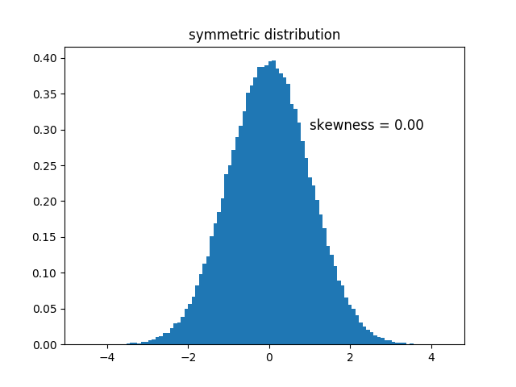
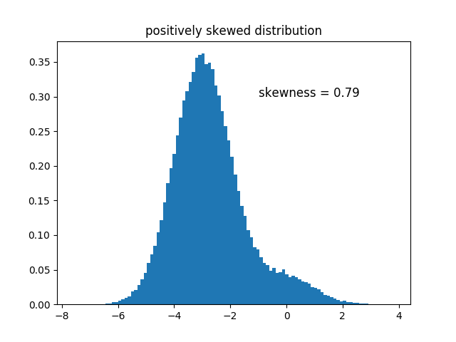
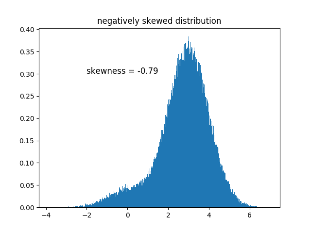
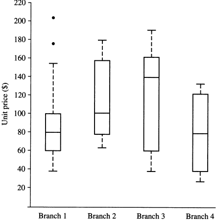
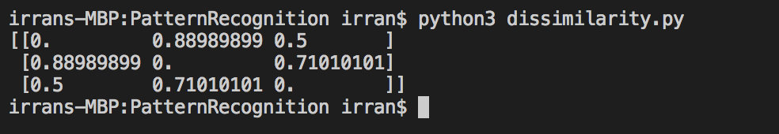
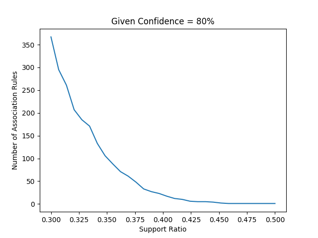
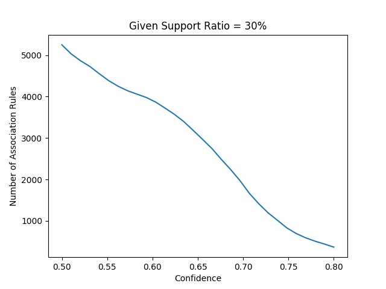
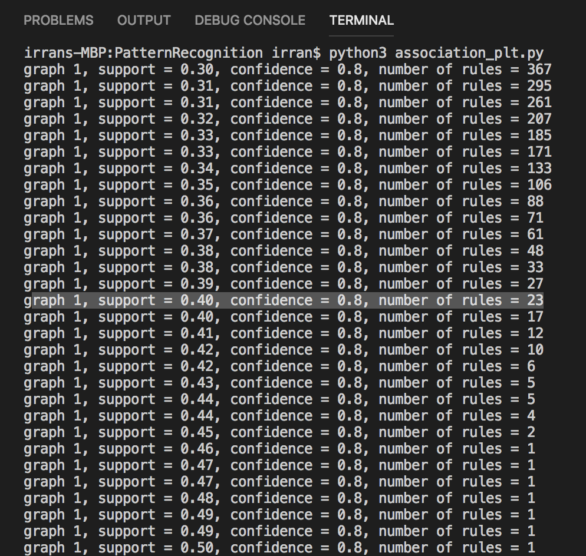
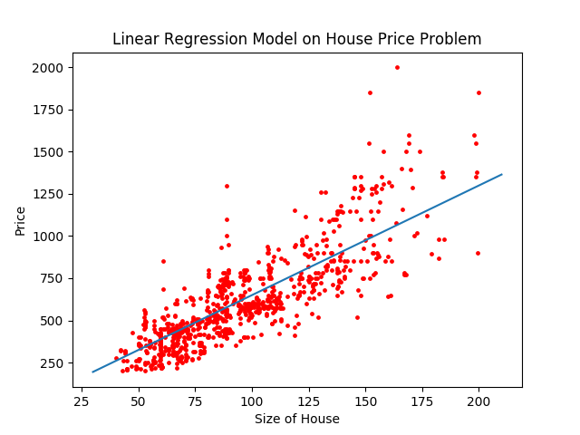

# Student Info
 - Student ID: 2016302580055
 - Student Name: 了然

# Ethical Concerns in Data Mining

The use of data mining, especially data about people, has serious ethical implications. Companies face an ethical dilemma when even deciding if the company should make a person aware his/her information is being stored for future data mining. By giving a person the option to opt out of data collection, a company can hurt its competitive advantage in a market place. A company must decide if a lack of ethical concern will cause a loss in good will from consumers and suffer from a backlash from the company’s consumers. Companies who use data mining techniques must act responsibly by being aware of the ethical issues that are surrounding their particular application; they must also consider the wisdom in what they are doing. For example, data mining sometimes can be used to discriminate people, especially regarding racial, sexual and religious orientations. The use of data mining in this way is not only considered unethical, but also illegal. Individuals need to be protected from any unethical use of their personal information, and before they make any decision to provide their data they need to know how this information will be used, why is it being use, what parts of the information are going to be taken, and what consequences this action will have. By doing this, Individuals will be informed and told straightforwardly about the reasons and consequences of using their information. Ethical concerns in data mining can be seen in two main ethical themes and these relate to privacy and individuality. As mentioned previously, the wrong use of data can cause people to fall in unethical issues, which are also considered illegal. The importance of privacy and individuality has to be valued and believe protected to make sure that people are treated reasonably. People should be conscious of the significance of the threats and dangers and constantly discuss these ethical issues. Experts consider data mining to be morally neutral, on the other hand, the way that this data is being used may come up with questions and concerns about ethics. Data need to be used in the right purpose to make sure people are safe.

# Skewness

Skewness is asymmetry in a statistical distribution, in which the curve appears distorted or skewed either to the left or to the right. Skewness can be quantified to define the extent to which a distribution differs from a normal distribution. See details of codes in `skewness.py`

### Formula

~~~python
# function to compute skewness of given data
def skewness(data):
    mu =  np.mean(data)
    sigma = np.std(data)
    skew = (data - mu) / sigma
    skew = skew ** 3
    skew = np.sum(skew) / len(data)
    return skew
~~~

### Symmetric Distribution

Data presented above is normally distributed generated by the following codes.

~~~python
data = np.random.normal(0, 1, size=100000)
~~~

### Positive Skew

The right tail is longer; the mass of the distribution is concentrated on the left of the figure. The distribution is said to be right-skewed, right-tailed, or skewed to the right, despite the fact that the curve itself appears to be skewed or leaning to the left; right instead refers to the right tail being drawn out and, often, the mean being skewed to the right of a typical center of the data. A right-skewed distribution usually appears as a left-leaning curve

Data presented above is positively skewed, which is a superposition of two independent normal distribution generated by the following codes.

~~~python
data = np.random.normal(0, 1, size=10000)
data = np.append(data, np.random.normal(-3,1,90000))
~~~

### Negative Skew

The left tail is longer; the mass of the distribution is concentrated on the right of the figure. The distribution is said to be left-skewed, left-tailed, or skewed to the left, despite the fact that the curve itself appears to be skewed or leaning to the right; left instead refers to the left tail being drawn out and, often, the mean being skewed to the left of a typical center of the data. A left-skewed distribution usually appears as a right-leaning curve.

Data presented above is negative skewed, which is a superposition of two independent normal distribution generated by the following codes.

~~~python
data = np.random.normal(0, 1, size=10000)
data = np.append(data, np.random.normal(3,1,90000))
~~~

# Boxplot

Brach 1 is basically symmetric distributed, ranging from $40 to $155 approximately. However, the two black points on the top may represent some outliers and need to be detected or removed before further research. Branch 2 is positively skewed and branch 3 is negatively skewed. Branch 4 is also symmetric   distributed and is more evenly distributed than branch 1. Also, its range is smaller than branch 1.

# Q-Q Plot

Compute percentile instead of actual data to draw Q-Q plot if they don't have same number of data.

# Dissimilarity Matrix

Assume I have ten attributes for each person. **Age**, **height**, **weight** and **salary** are numeric attributes. **sex** and **is_married** are binary attributes. **Ethnic**, **hair_color** and **eye_color** are nominal attributes. **Education_background** is ordinal attribute. See details of codes in `dissimilarity.py`

Here are examples of three person.

~~~python
person1 = [18,170,60,1000,1,0,'Asian','silver','black','high school']
person2 = [32,175,80,90000,0,1,'African American','black','brown',"bachelor's degree"]
person3 = [25,180,70,100000,1,0,'Asian','silver','blue',"master's degree"]
~~~

Here's dissimilarity matrix of the three person above

# Association Analysis

### Algorithm for Generating Random Data

~~~python
def getRandomData():
    data_no = 10000
    total_product_no = 100
    threshold = 0.50

    possibility1 = np.random.normal(0.45, 0.2, total_product_no)
    possibility2 = np.random.normal(0.45, 0.2, total_product_no)
    data = []
    for _ in range(data_no):
        itemset = []
        possibility_first = np.random.rand()
        possibility_other = np.random.rand(total_product_no)
        if possibility_first > threshold:
            itemset.append(0)
            for j in range(1, total_product_no):
                if possibility_other[j] < possibility1[j]:
                    itemset.append(j)
        else:
            for j in range(1, total_product_no):
                if possibility_other[j] < possibility2[j]:
                    itemset.append(j)
        data.append(itemset)
    return data
~~~

All data used for test my algorithm is generated by the above codes. 

First of all, we cannot generate data completely randomly. Since if whether one product occurs is totally independent with other products, there's no latent relation among them. Thus there's no potential pattern that we can learn by running our algorithm.

As a result, I assume a series of probability to generate some related data. First I assume the first products will occur randomly, namely probability of 50%, and variable `threshold` holds this value. Then `possibility1[i]` represents the probability of i*th* product occurs in a record when the first product occurs, namely a conditional probability expressed by `P(Xi|X1)` where `Xi` represents the event that i*th* product occurs in a record. Similarly, `possibility2[i]` represents the probability of i*th* product occurs in a record when the first product **doesn't** occur, namely a conditional probability expressed by `P(Xi|~X1)` where `~X1` represents the first product doesn't occur in a record.

Based on the probability I assumed above, a series of data can be generated by it. Although the conditional probability represented by `P(Xi|Xj)` where `i!=j` cannot be calculated by the known value above, I believe they're somehow related. It's just hard to express it in math strictly.

In addition, there're several **hyper-parameters** in the beginning of codes that can affect the distribution of generated data greatly. Those parameters need to be tuned extremely carefully to make sure the data generated is suitable and acceptable to our algorithm.

See details of codes in `dataset.py`.

### Apriori Algorithm

Apriori algorithm calculate support ratio for each possible frequent itemset. It starts from the simplest itemset, namely itemset contains only one item. Then, this algorithm keep joining those small itemsets to form bigger itemset and compute its support ratio. Apriori follows an important property, namely, **all nonempty subsets of a frequent itemset must also be frequent**. Thus it can reduce its search space in some degree and accelerate the process of calculation. See details of codes in `apriori.py`.

### FP-Growth Algorithm

However, apriori algorithm has to iterate through all data in each loop, which is unacceptable due to its low efficiency, especially when dataset is extremely huge. Thus FP-Growth algorithm is introduced to solve this problem. In FP-Growth algorithm, dataset needs be scanned only twice no matter how huge it is. In the first scan, frequency of elements is computed. Then in the second scan, a data structure call FP-Tree and a header table is built. After that we can find all frequent itemset by keep mining this FP-Tree recursively. See details of codes in `fpgrowth.py `.

### Number\_of\_Rules - Support\_Ratio Graph

The graph above is generated by running **FP-Growth** algorithm multiple times with confidence of 80% and different support ratio. It's obvious that as support ratio growing, the number of association rules drop significantly.

~~~python
x = np.linspace(0.30,0.50,30)
y = []
for support_ratio in x:
	_, rules = fpgrowth(dataset, support_ratio, 0.8)
	y.append(len(rules))
	print('graph 1, support = %.2f, confidence = 0.8, number of rules = %i' % (support_ratio, len(rules)))
print(y)
plt.plot(x, y)
plt.title('Given Confidence = 80%')
plt.xlabel('Support Ratio')
plt.ylabel('Number of Association Rules')
plt.savefig('confidence80')
plt.show()
~~~

### Number\_of\_Rules - Support\_Ratio Graph

The graph above is generated by running **FP-Growth** algorithm multiple times with support ratio of 30% and different confidence. It's obvious that as confidence growing, the number of association rules drop although less significant than `Number_of_Rules - Support_Ratio` graph.

~~~python
x = np.linspace(0.5,0.8,30)
y = []
for confidence in x:
	_, rules = fpgrowth(dataset, 0.3, confidence)
	y.append(len(rules))
	print('graph 2, support = 0.3, confidence = %.2f, number of rules = %i' % (confidence,len(rules)))
print(y)
plt.plot(x,y)
plt.title('Given Support Ratio = 30%')
plt.xlabel('Confidence')
plt.ylabel('Number of Association Rules')
plt.savefig('support30')
plt.show()
~~~

As showed in the running result, given confidence equals 80%, the number of association rules is greater than 20 when support ratio is 40%. At this point, there're 23 rules exist.

# House Price Problem

The figure above demonstrates the result of linear regression model on house price problem. As you can see, this simple model fit our data in some degree and the model converges very fast. However, this model comes with inevitable defects. It assumes the price of house only related to the size of house, which of course is an oversimplified model and is not practical in real situation. Also, the relation between features, like size of house, and price may not as simple as linear relation. They may more complex so that linear regression cannot fit properly. At this point, polynomial regression or even neural network algorithm should be taken into consideration. See details of codes in `house.py`